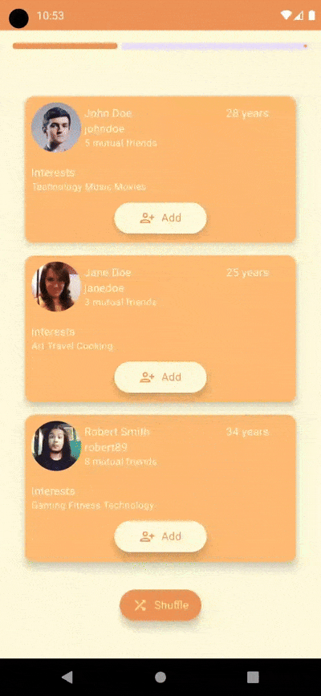

# SuggestionFriends - Animations

**SuggestionFriends** is an app with engaging animations designed to provide a seamless user experience while browsing through suggested friends. This README focuses on the animations used within the application.

## Animations in the Application

The app uses Jetpack Compose animations to enhance the user experience. Here’s a summary of the main animations:

### 1. **User Profile Card Animations**

- **Scale Animation**: When the user profile cards appear, they animate with a scaling effect. The profiles start from a smaller size and gradually scale up to their normal size, giving a smooth transition.

    - **Animation Type**: `spring()`
    - **Damping Ratio**: Low Bouncy
    - **Stiffness**: Low

  This makes the profile cards feel more dynamic as they enter the screen.

### 2. **Progress Bar Animation**

- **Linear Progress Bar**: A linear progress bar is displayed at the top of the screen to indicate the progress of loading new friend suggestions.

    - **Animation Type**: `LinearEasing`
    - **Duration**: The progress bar animates over a specified time based on the `countDownTime` (in seconds).
    - **Behavior**: The progress bar starts with full progress and animates to 0% as the timer counts down.

### 3. **Profile Information Transition**

- **Smooth Transitions**: When a new user is suggested, their profile information smoothly transitions into view. This transition is achieved with scaling and position-based animations to ensure smooth visual feedback.

### Key Libraries and Tools Used for Animations

- **Jetpack Compose Animation**: Jetpack Compose provides a variety of tools to handle animations, including `Animatable`, `AnimatedVisibility`, `tween`, and `spring`. The app uses these components to animate profile cards, buttons, progress bars, and other UI elements.
- **StateFlow**: StateFlow is used to track changes in the data and trigger UI updates with animations.

## Conclusion

These animations aim to make the app feel dynamic and responsive. They ensure that the user experience is smooth while navigating through friend suggestions and interacting with different UI elements.